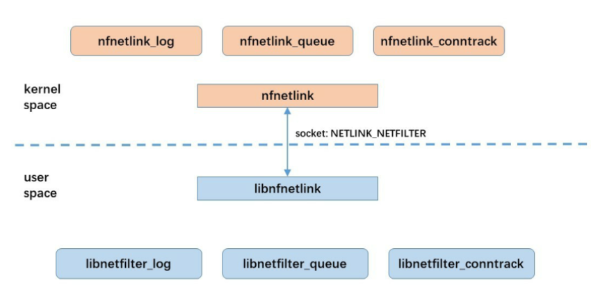
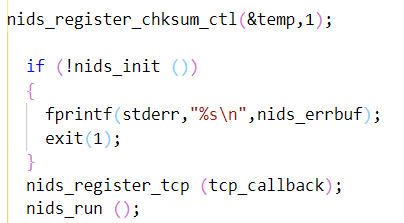

# network_programing
This repository is about the course of linux network programming and many different network attack methods.

## 😁remote control

Client sends the commands to server and return the result.

**ALL code in remote_control.c .**

## 😐port scan using multi thread

Find the target host 's  open port and its service using multi thread.

**ALL code in threadscan.c .** 

## 😁SYN flood 

SYN flood attack which needs to construct ip header and tcp header.

**ALL code in synflood.c .** 

## 😛chat using multi thread

Using multi thread to deal with different  connections from users.

**ALL code in thread_server.c and thread_client.c .**

```c
pthread_create(&thread_id, NULL, (void *)client_fun, (void *)connectd);  
```

You can also use multi process which need more resources.

## 😛ARP cheat

Send arp packet with fake MAC. And then victim's MAC cache will be changed.

**ALL code in arp_cheat.c.**

A common use of ARP cheat is to make victim have no access to Internet service.

## 👌sniff using libpcap

Sniff packets using libpcap and Print printable characters.

**All code in sniff.c .**

```shell
gcc -o -l pcap
```

## 😉libnet construct packet 

Install libpcap and libnet first. **All code in icmp_smurf.c** which Implements **ICMP Smurf** attack.

ICMP smurf attack can construct icmp echo packet to make ping successfully.

**ALL code in icmp_smurf.c .**

```shell
gcc -o    -lnet
```

## 😐firewall iptables command

**All code in firewall.sh .** 

```shell
iptables -A FORWARD -p icmp -j ACCEPT

iptables -A INPUT -p tcp --dport 22 -j DROP 
```

## 😥firewall construct using netfilter

Netfilter: Packet filtering in Linux kernel. **All code in netfilter_firewall.c** .

Packets captured in kernel are sent to user space and user-defined action. 




## ✌️sniff with libnids

Install libnids first. **All code in libnids_sniff.c** . It can be used to sniff pop3 commands.

libnids: network data capture, IP or TCP data recombination, intrusion detection.

Libnids common use process:  [(libnids学习笔记_stSahana的博客-CSDN博客_libnids](https://blog.csdn.net/stSahana/article/details/79501050)



```shell
gcc libnids_sniff.c -o sniff -lpcap -lnet -lnids -lgthread-2.0 -lglib-2.0
```

